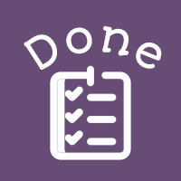

<h2 style=" text-align=center";> Task-Dashboard</h2>

This is an app to add your task and your events in the calendar ; to help orgnize your life 

<h2 style=" text-align=center";>Use :</h2>
- In the tasks page add your tasks that you aim to acheive  
- When you are done with the task you can mark it as done with a line through when clicking on the check icon , or if you changed your mind you can delete it by clicking on the X icon 
- In the calendar page choose the days that is important to you by many options(clicking on the days and switching the months with the arrows , writing the specific date with the year and month on the text box, clicking on today button to bring you back to today's events ) 
- By clicking on the add icon you can add your events and important things to do by specializing the event name and starting and ending time 
- Click on the check mark next to the event name to mark it as done then click on OK in the alert to delete the event  

 <h2 style=" text-align=center";>Description</h2>
I believe that ornaized goals/tasks will lead to orgnaized success , by being consistent to the daily/monthly/weekly tasks the way will be brighter to walk in . I tried to make this project as simple as possbile to make the thoughts clear to use as approachabel goals .
